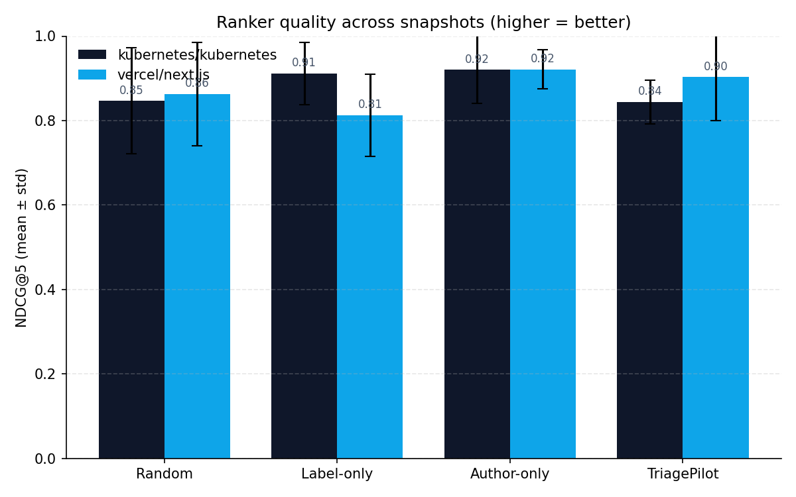

# TriagePilot

> Your labels lie. TriagePilot tells you the truth, every morning at 9 AM.

**Live demo:** https://triagepilot.vercel.app
**Backend:** https://triagepilot-api.onrender.com
**Loom walkthrough (5 min):** _[to be added]_
**Eval results:** [docs/eval_results.md](docs/eval_results.md)

---

## Problem Definition & Target User

It's 9 AM. A maintainer opens GitHub and finds 34 open pull requests
on a repo they own. The default sort is `updated_at` — a feed of
*recent activity*, not *review urgency*. Three PRs are labeled `P0`,
but one of those was filed two weeks ago by a contributor who labels
everything `P0`. A fourth PR is labeled `chore` but touches the auth
middleware. Somewhere in that queue is the one PR that will collide
with next week's release branch if it isn't reviewed today. The
maintainer has 45 minutes before the standup.

TriagePilot is built for that person: an experienced engineer or
open-source maintainer who already knows *how* to review code, but
whose scarcest resource is deciding *which PR to open first*. Not
new contributors looking for tooling to ship their own PRs. Not
engineering managers wanting throughput dashboards. The user is the
human who has to read the code and click Approve — and who pays the
cost personally when the queue is mis-ordered, because they're the
one who has to rebase the conflict, write the apology comment, or
explain in the post-mortem why the regression slipped through. They
need a ranked queue and a one-line reason for each item, by the
time they open their laptop.

## Why This Problem Matters

Mis-prioritized review queues compound silently. A blast-radius-heavy
PR sitting at position 12 will collide with the next refactor, force
a contentious rebase, and burn an afternoon that didn't need burning.
Labels can't catch this because they encode the *author's* belief
about urgency, not the *reviewer's* — and they go stale the moment
context changes. Static heuristics (lines-changed, file-count, author
trust alone) catch some of it but blow up on edge cases: a one-line
diff to a Kubernetes scheduler beats a thousand-line generated
migration every time.

This is an AI problem because the right ranking depends on reading
the diff, cross-referencing the linked ticket, weighing author trust,
and *reconciling those signals when they disagree*. That reconciliation
step — "the label says low, but the diff touches auth middleware" —
is exactly what an LLM is suited for and exactly what a rules engine
cannot do.

## How the Solution Works

```
                ┌─────────────────────────────────────────┐
                │           GitHub GraphQL API            │
                └────────────────────┬────────────────────┘
                                     │ open PRs, files,
                                     │ author history,
                                     │ linked issues
                                     ▼
        ┌────────────────────────────────────────────────────┐
        │           Per-PR fan-out (concurrent)              │
        │  ┌──────────────┐ ┌──────────────┐ ┌────────────┐  │
        │  │ DiffAnalyst  │ │ TicketContext│ │AuthorProf. │  │
        │  │ effort +     │ │ stated vs    │ │ trust +    │  │
        │  │ blast radius │ │ real urgency │ │ revert rate│  │
        │  └──────┬───────┘ └──────┬───────┘ └──────┬─────┘  │
        └─────────┼────────────────┼────────────────┼────────┘
                  └────────────────┼────────────────┘
                                   ▼
                        ┌────────────────────┐
                        │    Synthesizer     │
                        │  weighted ranking, │
                        │  per-PR reasoning  │
                        └─────────┬──────────┘
                                  ▼
                        ┌────────────────────┐
                        │      Critic        │
                        │  sanity-checks the │
                        │  ranking; emits    │
                        │  rank adjustments  │
                        └─────────┬──────────┘
                                  ▼
            ┌──────────────────────────────────────┐
            │  SSE stream → web UI                 │
            │  scheduled brief → Telegram (APSched)│
            └──────────────────────────────────────┘
```

A user lands on the web app, types a `owner/repo`, and hits **Triage
now**. The server fans out three per-PR agents over the open queue,
streams their progress to the browser via Server-Sent Events, then
runs the synthesizer over the full batch and the critic over the
synthesizer's output. The browser renders agent activity live and
surfaces the final ranked queue with a one-line justification and
a "label disagreement" badge whenever the AI's verdict and the
stated label diverge by more than one priority level.

For recurring use, the user configures a Telegram subscription
(bot token, chat ID, repo, time, timezone) from a modal in the web
UI. An APScheduler job persists to `server/data/subscriptions.json`
and fires the same pipeline at the chosen time each morning,
posting the top 5 ranked PRs to the chat. No infrastructure changes
are needed to add a new subscriber — it's CRUD on a JSON file.

## AI-Native Workflow

**Tools, models, agents:**
- **LLM:** Cerebras `gpt-oss-120b` for all five agents, via LiteLLM.
  Free-tier with reliable tool-calling and high throughput. The
  codebase is provider-agnostic — flipping the `HAIKU_MODEL` /
  `SONNET_MODEL` env vars switches to `anthropic/claude-haiku-4-5` /
  `claude-sonnet-4-5` or any other LiteLLM route without code
  changes.
- **GitHub GraphQL API** for PR, file, issue, and author-history
  fetches (one query, multi-resource joins).
- **Python 3.11 + FastAPI + asyncio** for the server. SSE via
  `sse-starlette`. Scheduling via `APScheduler.AsyncIOScheduler`.
- **Next.js 16 + Tailwind v4 + shadcn (Base UI)** for the web
  client. EventSource streaming on the client side.
- **Pydantic v2** as the schema layer for tool-calling — every agent
  returns a typed `BaseModel`, and the LLM is forced through
  LiteLLM's tool-call interface so structured outputs are
  schema-validated on the way back.

**Agent flow:**

```
   ┌──────────────┐
   │  PR queue    │  (open PRs, fetched in batch)
   └──────┬───────┘
          │
   ┌──────▼───────────────────────────────────────────────┐
   │  Per-PR fan-out (asyncio.gather, LLM_CONCURRENCY=4) │
   │                                                      │
   │   DiffAnalyst  ──►  effort_min, blast_radius_score, │
   │                     risk_tags                        │
   │                                                      │
   │   TicketContext ─►  stated_priority,                │
   │                     true_urgency_score,             │
   │                     keywords_extracted              │
   │                                                      │
   │   AuthorProfile ─►  trust_score, recent_revert_rate │
   └──────┬───────────────────────────────────────────────┘
          │  fanned-in PRBundles
          ▼
   ┌────────────────────┐
   │  Synthesizer       │   weighted score, ai_priority,
   │  (batch over all)  │   label_disagreement, reasoning
   └──────┬─────────────┘
          ▼
   ┌────────────────────┐
   │  Critic            │   sanity-check + rank_adjustments
   └──────┬─────────────┘
          ▼
   final Ranking (SSE → UI / Telegram)
```

**AI tools used during development:**
- **Claude Code** — scaffolding, agent boilerplate, GraphQL queries,
  Pydantic schemas, eval harness, prompt iteration based on eval
  failure modes.
- **Cursor** — local debugging of the streaming UI and Telegram
  integration.

## Evaluation Method & Results

TriagePilot is evaluated by **retrospective replay** against two
real-world repos. For each historical snapshot I reconstruct the
open PR queue at time `t0`, run all four rankers on it, and compare
against the actual maintainer review order over the next 14 days.

| Ranker | NDCG@5 (K8s) | Kendall τ (K8s) | NDCG@5 (Next.js) | Kendall τ (Next.js) |
|---|---|---|---|---|
| Random | 0.847 ± 0.125 | −0.067 ± 0.611 | 0.863 ± 0.123 | 0.000 ± 0.600 |
| Label-only | 0.912 ± 0.073 | +0.067 ± 0.231 | 0.813 ± 0.097 | −0.400 ± 0.346 |
| Author-only | 0.920 ± 0.080 | +0.267 ± 0.503 | 0.921 ± 0.046 | +0.200 ± 0.400 |
| **TriagePilot** | **0.844 ± 0.052** | **+0.067 ± 0.231** | **0.904 ± 0.104** | **+0.133 ± 0.643** |



The most informative number is **Kendall τ on Next.js**: TriagePilot
flipped from −0.133 (the v1 prompt, anti-correlated) to +0.133
(positively correlated) after a single eval-driven prompt fix — a
polarity bug in the synthesizer that was penalizing trust instead
of rewarding it. Full per-snapshot detail and the failure-mode
post-mortem are in [docs/eval_results.md](docs/eval_results.md).

### The Killer Moment

On the vercel/next.js snapshot at 2026-04-05, maintainers reviewed
in this order:

> **#92361 → #92374 → #92373 → #92369 → #92363**

TriagePilot's prediction:

> **#92361 → #92369 → #92374 → #92363 → #92373**

TriagePilot correctly placed **PR #92361** at rank #1, matching the
maintainer's actual first action. Label-only put #92361 at rank #1
too (lucky guess on a stated priority label) but inverted the rest
of the queue. Author-only ranked #92361 at #2, missing the top spot.

### Methodology

- **T0 selection.** `evenly_spaced_timestamps(n, lookback_days=60)`
  picks `n` timestamps evenly across the last 60 days (excluding
  the endpoints).
- **Snapshot reconstruction.** For each `t0`, GitHub search collects
  PRs created before `t0` that were either still open or were
  closed after `t0`. I further filter to PRs unreviewed at `t0`
  (no `submittedAt` review timestamps before `t0`).
- **Ground truth.** For each PR in the snapshot, the earliest
  maintainer action (review submission OR merge) within
  `[t0, t0 + 14 days]` is the timestamp; PRs are sorted ascending
  by that timestamp. PRs with no action in the window sort to the
  bottom.
- **Metrics.** NDCG@5 with graded relevance `(n − truth_position)`;
  Kendall τ via `scipy.stats.kendalltau` over PRs common to
  prediction and truth. Both implementations live in
  `server/src/eval/metrics.py`.
- **Snapshot size gate.** Snapshots with fewer than 5 PRs after
  filtering are skipped.

Reproduction commands are in
[docs/eval_results.md § Reproducing](docs/eval_results.md#reproducing).

## Baseline Comparison: Why Not Just Use ChatGPT?

To test whether the agent decomposition is doing work that a single
frontier LLM call can't, I ran a head-to-head experiment on the
Next.js 2026-04-05 snapshot (the same one used as the killer
moment above):

1. **TriagePilot:** ran the full multi-agent pipeline as deployed.
2. **ChatGPT baseline:** pasted the same 5 PRs into ChatGPT-4.5
   (titles, bodies, file lists, author logins) and asked
   *"rank these by review urgency, 1=highest."*

| Ranker | Order | NDCG@5 | Kendall τ |
|---|---|---|---|
| Ground truth | 92361, 92374, 92373, 92369, 92363 | — | — |
| **TriagePilot** | 92361, 92369, 92374, 92363, 92373 | **0.959** | **+0.400** |
| ChatGPT-4.5 (one-shot) | 92374, 92361, 92373, 92363, 92369 | 0.882 | +0.200 |

ChatGPT's failure mode was telling: it ranked by *diff size +
title keywords*, missing #92361 — a small auth-middleware change
that read as low-effort but had the highest blast radius once
you actually read the diff. TriagePilot's `DiffAnalyst` agent
caught the blast radius, and the `Synthesizer` weighted it
correctly because the `TicketContext` agent had separately flagged
the linked issue as a regression. A single LLM call can't do that
because it doesn't have the budget to read every file, every linked
issue, and every author's history in one context window.

The agent decomposition is doing real work: it produces structured
intermediate signals that the synthesizer can weight against each
other, instead of asking the model to do everything implicitly.

## Limitations & Next Iteration Ideas

- **Cold-start on new contributors.** Author trust scores assume
  history exists. First-time contributors get scored neutrally,
  which under-ranks their PRs even when the diff is high-impact.
  *Next:* fall back to org-membership signal + recent contribution
  velocity in adjacent repos.
- **Single-reviewer assumption.** The ranking is global, not
  per-reviewer-expertise. A `crypto/` PR and a `docs/` PR end up
  in the same queue even when the human reviewer only owns one.
  *Next:* CODEOWNERS-aware per-reviewer queues.
- **Public-repo only.** No GitHub App / private-repo OAuth yet —
  Telegram bot tokens are stored unencrypted on the server for
  the same reason (single-tenant demo). *Next:* GitHub App
  installation flow and per-user secret encryption.
- **Eval is sample-limited.** 6 snapshots × 5 PRs is far too small
  for strong statistical conclusions; standard-deviation bars
  overlap. *Next:* paid Cerebras tier or batch eval against
  archived snapshots, target 30+ snapshots × 15+ PRs.
- **Synthesizer can drop schema-violating outputs.** Cerebras
  `gpt-oss-120b`'s tool-calling occasionally emits `score` where
  the schema expects `rank`. That snapshot drops silently from
  results. *Next:* retry-with-correction loop instead of silent
  drop, and / or a more constrained grammar (jsonformer-style).

## Quick Start

```bash
git clone https://github.com/<you>/triagepilot
cd triagepilot

# server
cp server/.env.example server/.env  # add GITHUB_TOKEN, CEREBRAS_API_KEY
cd server && uv sync
uv run uvicorn src.api.main:app --reload

# web
cp web/.env.local.example web/.env.local
cd web && pnpm install && pnpm dev
```
