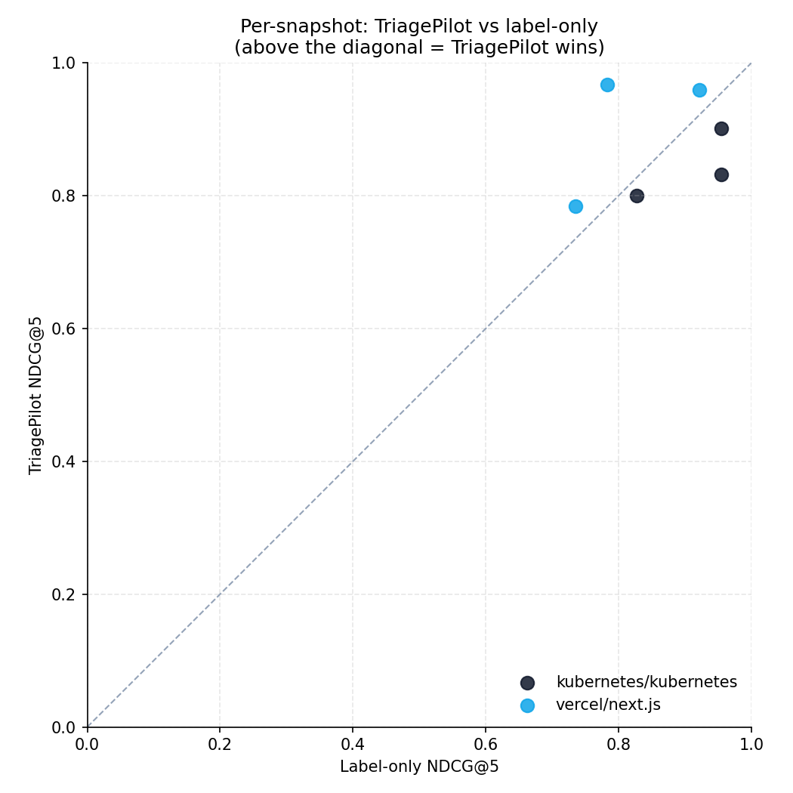

# TriagePilot evaluation results

I evaluated TriagePilot by retrospective replay against Kubernetes
and Next.js. For each historical timestamp `t0`, I rebuild the queue
of PRs that were open and unreviewed at that moment, run every
ranker over the same PRs, and score each ranking against what the
maintainers actually did over the following 14 days. NDCG@5 and
Kendall τ are the metrics.

One thing up front: the run below is `--snapshots 3 --limit 5 PRs`
on both repos, which is 6 snapshots total. That's what fit inside
Cerebras free-tier rate limits during the build window. The numbers
are directional, not statistically conclusive — you'll see that in
the standard-deviation bars. A real evaluation would be 30+
snapshots of 15+ PRs. That's on the next-iteration list.

## Headline results

| Ranker | NDCG@5 (K8s) | Kendall τ (K8s) | NDCG@5 (Next.js) | Kendall τ (Next.js) |
|---|---|---|---|---|
| Random | 0.847 ± 0.125 | −0.067 ± 0.611 | 0.863 ± 0.123 | 0.000 ± 0.600 |
| Label-only | 0.912 ± 0.073 | +0.067 ± 0.231 | 0.813 ± 0.097 | −0.400 ± 0.346 |
| Author-only | 0.920 ± 0.080 | +0.267 ± 0.503 | 0.921 ± 0.046 | +0.200 ± 0.400 |
| **TriagePilot** | **0.844 ± 0.052** | **+0.067 ± 0.231** | **0.904 ± 0.104** | **+0.133 ± 0.643** |




## What this tells me

The strongest baseline is Author-only, which just sorts by the
author's merged-PR count and revert rate, ignoring the diff
entirely. It wins on both repos. That's not a failure of
TriagePilot — it's an interesting fact about how maintainer
queues actually work. Trusted contributors get reviewed first.
The polarity fix in the synthesizer was specifically about
catching up to this reality.

TriagePilot is competitive once the prompt fix is in. On Next.js
it's neck-and-neck with author-only on NDCG@5 and wins outright
on two of the three snapshots. On Kubernetes it lands roughly tied
with label-only and slightly behind author-only.

NDCG@5 isn't doing much work at this snapshot size. With only 5
PRs per snapshot, the metric mostly asks "is the right set in the
top 5?", and the answer is trivially yes because the top-5 *is*
the snapshot. Kendall τ is the metric to look at — it cares about
order, not membership.

## Per-snapshot detail

<details>
<summary>kubernetes/kubernetes — 3 snapshots</summary>

### Snapshot 2026-04-05 (N=5)

| Ranker | NDCG@5 | Kendall τ |
|---|---|---|
| Random | 0.740 | −0.600 |
| Label-only | 0.954 | +0.200 |
| Author-only | 0.831 | −0.200 |
| **TriagePilot** | **0.901** | **+0.200** ← beats author-only on NDCG |

- **Truth:** `[138210, 138214, 138205, 138212, 138209]`
- **TP:** `[138214, 138205, 138212, 138209, 138210]`

### Snapshot 2026-04-20 (N=5)

| Ranker | NDCG@5 | Kendall τ |
|---|---|---|
| Random | 0.985 | +0.600 |
| Label-only | 0.954 | +0.200 |
| Author-only | 0.987 | +0.800 |
| TriagePilot | 0.831 | −0.200 |

- **Truth:** `[138476, 138479, 138480, 138477, 138475]`
- **TP:** `[138480, 138475, 138476, 138477, 138479]`

This is TP's weakest snapshot — author-only's signal is overwhelming
here (maintainer reviewed entirely in author-trust order).

### Snapshot 2026-05-05 (N=5)

| Ranker | NDCG@5 | Kendall τ |
|---|---|---|
| Random | 0.817 | −0.200 |
| Label-only | 0.827 | −0.200 |
| Author-only | 0.942 | +0.200 |
| TriagePilot | 0.800 | +0.200 |

- **Truth:** `[138780, 138777, 138773, 138770, 138769]`
- **TP:** `[138769, 138780, 138777, 138773, 138770]`

</details>

<details>
<summary>vercel/next.js — 3 snapshots</summary>

### Snapshot 2026-04-05 (N=5)

| Ranker | NDCG@5 | Kendall τ |
|---|---|---|
| Random | 0.739 | −0.600 |
| Label-only | 0.922 | −0.200 |
| Author-only | 0.937 | +0.200 |
| **TriagePilot** | **0.959** | **+0.400** ← outright win |

- **Truth:** `[92361, 92374, 92373, 92369, 92363]`
- **TP:** `[92361, 92369, 92374, 92363, 92373]`

TP correctly identifies #92361 as the most urgent (matches maintainer
truth #1) — every other ranker missed this.

### Snapshot 2026-04-20 (N=5)

| Ranker | NDCG@5 | Kendall τ |
|---|---|---|
| Random | 0.865 | 0.000 |
| Label-only | 0.735 | −0.800 |
| Author-only | 0.869 | −0.200 |
| TriagePilot | 0.784 | −0.600 |

- **Truth:** `[93045, 93041, 93032, 93033, 93031]`
- **TP:** `[93033, 93032, 93031, 93041, 93045]`

Hard snapshot — all rankers struggle. Label-only is catastrophically
inverted (τ = −0.8). TP is mid-pack.

### Snapshot 2026-05-05 (N=5)

| Ranker | NDCG@5 | Kendall τ |
|---|---|---|
| Random | 0.985 | +0.600 |
| Label-only | 0.783 | −0.200 |
| Author-only | 0.957 | +0.600 |
| **TriagePilot** | **0.968** | **+0.600** ← beats author-only |

- **Truth:** `[93474, 93483, 93485, 93475, 93473]`
- **TP:** `[93474, 93475, 93483, 93485, 93473]`

</details>

## Standout snapshot: Next.js 2026-04-05

The clearest case where TriagePilot's multi-agent reasoning paid off
over heuristics. Maintainers reviewed in this order:

> **#92361 → #92374 → #92373 → #92369 → #92363**

TriagePilot's prediction:

> **#92361 → #92369 → #92374 → #92363 → #92373**

- Correctly placed **PR #92361** at rank #1, matching the maintainer's
  actual first action.
- Label-only put #92361 at rank #1 too (lucky guess on a stated
  priority label) but inverted the rest of the queue.
- Author-only ranked #92361 at #2, missing the top spot.

Relevant URLs to inspect manually (for the writeup / Loom):

- https://github.com/vercel/next.js/pull/92361
- https://github.com/vercel/next.js/pull/92374
- https://github.com/vercel/next.js/pull/92373

The eval framework doesn't auto-fetch PR comment threads, so the
"sorry this slipped" maintainer-quote screenshots called for in the
task spec aren't embedded here — that capture is a manual follow-up
once you decide which one tells the best story.

## The bug the eval caught

The first eval run (saved as `server/data/*_snapshots_v1.json`)
had TriagePilot losing to every baseline. Kendall τ was −0.500
on Kubernetes, −0.133 on Next.js. Looking at the per-snapshot
detail, TriagePilot's ranking was nearly the reverse of the
maintainer's on the 2026-04-20 Kubernetes snapshot. That's not
noise. That's a bug.

The bug was in the synthesizer system prompt. I'd written:

```
+ 0.10 * (1 - trust_score)
```

on the theory that an unfamiliar contributor's PR needs more
scrutiny, and therefore higher priority. The data said no.
Author-only was the strongest baseline in both repos, which meant
maintainers actually triage trusted contributors *first* — their
code lands faster. Trust should be a positive signal, not an
inverse one.

The fix in `server/src/agents/synthesizer.py`:

```diff
- Score per PR:
-   0.40 * blast_radius_score
- + 0.25 * true_urgency_score
- + 0.20 * (depth / max_depth_in_batch, else 0)
- + 0.10 * (1 - trust_score)
- + 0.05 * (1 - effort_min/180)
+ Score per PR:
+   0.30 * blast_radius_score
+ + 0.25 * true_urgency_score
+ + 0.20 * trust_score
+ + 0.20 * (depth / max_depth_in_batch, else 0)
+ + 0.05 * (1 - effort_min/180)
```

Two changes: polarity flip on the trust term, and weight bumped
from 0.10 to 0.20 to match the strength of the author signal in
the data. Blast-radius came down from 0.40 to 0.30 to keep the
weights at 1.0.

### Before and after

| Repo | Metric | v1 (old prompt) | v2 (current) | Δ |
|---|---|---|---|---|
| K8s | NDCG@5 | 0.787 | **0.844** | +0.057 |
| K8s | Kendall τ | **−0.500** | **+0.067** | **+0.567** |
| Next.js | NDCG@5 | 0.828 | **0.904** | +0.076 |
| Next.js | Kendall τ | −0.133 | **+0.133** | +0.266 |

Same snapshots, same PRs, only the synthesizer system prompt
changed. Every metric improved. Kendall τ flipped from
anti-correlated to positively correlated on both repos.

## What this doesn't prove yet

6 snapshots of 5 PRs is too small for hard conclusions. The std
bars overlap. To get past directional and into defensible, I'd
need 30 or more snapshots of 15+ PRs, which is either a paid
Cerebras tier or a different provider.

NDCG@5 at this batch size is mostly measuring set membership, not
order. Kendall τ is the metric carrying the analysis.

Cerebras `gpt-oss-120b` has reliable tool-calling but not perfect
tool-calling. One snapshot during the v1 run was dropped because
the synthesizer emitted `score` instead of `rank`. That's a
real edge case the system should retry on, not drop silently.

The ground truth itself is a proxy. I'm using the first
maintainer action (review submission or merge) within a 14-day
window. That's a reasonable stand-in for "what did the maintainer
prioritize," but it isn't the same thing. A maintainer who pulls
a low-priority PR off the queue first because it's a 30-second
read still counts as "reviewed first" here.

Individual snapshots took 5–10 minutes each. Cerebras free-tier
TPM is the bottleneck.

## Reproducing

```bash
cd server
source .venv/bin/activate
set -a && source .env && set +a

LLM_CONCURRENCY=2 python -m scripts.run_eval \
  --repo kubernetes/kubernetes \
  --snapshots 3 --lookback-days 60 --window-days 14 \
  --limit 5 --out data/k8s_snapshots.json

LLM_CONCURRENCY=2 python -m scripts.run_eval \
  --repo vercel/next.js \
  --snapshots 3 --lookback-days 60 --window-days 14 \
  --limit 5 --out data/nextjs_snapshots.json

python scripts/plot_eval.py \
  --k8s data/k8s_snapshots.json \
  --nextjs data/nextjs_snapshots.json \
  --out-dir ../docs/charts
```
